<div align="center">



    

    

    

  



</div>

<br>

## 📑 Table of Contents

| | | |
|---|---|---|
| [What is lawCYpen?](#what-is-lawcypen) | [Attack & Automation](#attack-automation-tools) | [Burp Suite parity](#burp-suite-parity) |
| [Why it exists](#why-devtools-native-burp) | [Passive Analyzers](#passive-security-analyzers) | [Data handling & privacy](#data-handling-privacy) |
| [Getting started](#getting-started) | [AI, Triage & Reporting](#ai-triage-reporting) | [Keyboard shortcuts](#keyboard-shortcuts) |
| [How capture works](#how-capture-works) | [Pentest recipes](#pentest-recipes) | [FAQ](#faq) · [Troubleshooting](#troubleshooting) |
| [All 28 tabs at a glance](#all-28-tabs) | [Engagement checklist](#engagement-checklist) | [Known limitations](#known-limitations) · [Request limits](#request-limits) |
| [Core traffic tools](#core-traffic-tools) | [OWASP Top 10 mapping](#owasp-top-10-mapping) | [Design principles & security model](#design-principles-security-model) |
| [Scope](#scope-why-it-matters) | [Repeater's honest limit](#repeater-honest-limitation) | [By the numbers](#by-the-numbers) |
| [Contributing](#contributing) | [Glossary](#glossary) | [Release notes](#release-notes) |

<div align="center">
</div>


<div align="center">

</div>

<br>

<a id="what-is-lawcypen"></a>
##  What is lawCYpen?

**lawCYpen** is a browser DevTools extension for **authorized web-application penetration testing**. It is not a small add-on to the Network tab — it is a full HTTP traffic console that lives inside Chrome/Firefox DevTools and mirrors the workflow of **Burp Suite** wherever a browser extension architecturally can.

Most extensions only see what page JavaScript does through `fetch()`/`XHR`. lawCYpen instead listens to `chrome.devtools.network.onRequestFinished` — **the same API behind the real Network panel** — so every request the browser makes (navigations, XHR/fetch, images, fonts, stylesheets, everything) is recorded with accurate status codes, sizes, timings, and bodies. On top of that capture layer it provides **28 panel tabs**: History, Site Map, Repeater, Intruder, Comparer, Sequencer, Decoder, JWT Editor, Match & Replace, Session Handling Rules, Workflows, an opt-in Active Scanner, **18 Analysis sub-tabs** of passive detectors, AI-assisted correlation, Triage, and a Report builder.

<div align="center">
</div>

### The one-picture summary

<div align="center">
</div>

### The workflow it is built around

<div align="center">
</div>

<div align="center">

</div>

<a id="why-devtools-native-burp"></a>
## 🧭 Why a DevTools-native Burp?

<div align="center">
</div>

| Proxy-based tooling | lawCYpen (DevTools-native) |
|---|---|
| Sits **between** browser and server as a man-in-the-middle | Sits **inside** the browser and reads what the Network panel already reads |
| Needs a CA certificate to read HTTPS | HTTPS is already decrypted by the browser — **no CA cert, no MITM, no pinning breakage** |
| Separate application and window | One `F12` away, in the tab you are already testing |
| Capture is proxy-wide unless scoped by hand | Capture is **tab-scoped by construction**, then scope-filtered in software |
| Repeater/Intruder traffic leaves through a proxy process | Repeater/Intruder use the browser's own `fetch`, so **real session cookies attach automatically** |

**Benefits at a glance**

- **Zero setup friction** — no proxy config, no certificate install, no port to forward.
- **Ground-truth traffic** — what you see is what Chrome recorded, for every resource type.
- **Everything in one panel** — recon, tamper, fuzz, analyze, triage, and report without switching apps.
- **Safe by design** — scope enforced before storage; secrets masked before storage; the sandboxed response viewer cannot touch your session.
- **Honest tooling** — where a browser cannot do something (raw sockets, arbitrary `Cookie:` overrides), the tool and this document say so instead of faking it.

> This does **not** claim to replace Burp for every engagement. Raw-socket smuggling exploitation and literal `Cookie:` header overrides need a real proxy. See [Burp Suite parity](#burp-suite-parity).

<div align="center">

</div>

<a id="getting-started"></a>
## 🚀 Getting Started

<div align="center">
</div>

1. Open `chrome://extensions` → enable **Developer mode** → **Load unpacked** → select this folder.
   *(Firefox: the manifest declares a Gecko id and requires Firefox 121+.)*
2. On the tab you are testing, click the lawCYpen toolbar icon → **Authorize & monitor this site**. The popup lists your authorized targets.
3. Press `F12` → open the **lawCYpen** tab beside Elements / Console / Network.
4. Browse the app. **HTTP History** fills live.

<div align="center">
</div>

> **Capture only runs while DevTools is open** on that tab — exactly like the native Network tab. This follows from using the same API and is not a bug.

<div align="center">

</div>

<a id="how-capture-works"></a>
## ⚙️ How Capture Works

<div align="center">
</div>

`devtools/devtools.js` forwards every finished request to the background worker. Two correctness details matter:

- `getContent()` is wrapped in a **timeout**, so cancelled/redirected/odd responses still appear in History with their metadata instead of vanishing.
- The **`encoding` argument is honored** — some text responses arrive base64-encoded, and storing them as-is used to produce garbled bodies.

WebSocket **frame** messages are not exposed by the Network API, so they come from a page-context hook (`injected.js`, `MAIN` world) relayed by the `ISOLATED`-world `content-script.js`, which also scrapes script text for the analyzers.

<div align="center">
</div>

```
chrome.devtools.network (DevTools page) ──┐
injected.js (WS frames, MAIN world) ───────┼──→ background.js ──→ chrome.storage (history, findings, scope, repeater items)
content-script.js (script scraping) ───────┘         ↑
                                                       │ chrome.runtime.sendMessage
panel.js (the lawCYpen DevTools panel) ────────────────┘
```

Analyzer modules in `modules/*.js` are plain `scan(text, ctx) -> findings[]` functions called from `background.js`. See [Contributing](#contributing).

### Repeated headers survive intact

<div align="center">
</div>

Headers that legitimately repeat — `Set-Cookie` above all, also `Vary`, `Link` — were once collapsed to their last value everywhere. They are now preserved across passive capture, Repeater/Intruder live sends (which needed `Headers.getSetCookie()`, since the Fetch spec excludes `Set-Cookie` from generic iteration), and every raw-text round trip. A newline is the internal multi-value marker; a header value can never legally contain one, so it is lossless. This also makes "two disagreeing `Content-Length` values" detectable for the smuggling analyzer.

<div align="center"></div>

<div align="center">

</div>

<a id="all-28-tabs"></a>
## 🗺️ All 28 Tabs at a Glance

<div align="center">
</div>

Not every tab behaves the same. The map below shows which tabs stay entirely local, which can send requests to your target **only when you trigger them**, and which talk to third-party services.

<div align="center">
</div>

<div align="center">
</div>

<div align="center">

</div>

<a id="core-traffic-tools"></a>
## 🧩 Core Traffic Tools

<table>
<tr><td width="160"></td><td>

### Dashboard
Session overview: headline stats plus four bar charts — **secrets by severity**, **endpoints by confidence**, **HTTP methods seen**, and **top hosts by request count**. *Benefit:* know within seconds whether a target is quiet or noisy.

</td></tr>
<tr><td></td><td>

### HTTP History
Every request captured since DevTools opened — Burp's **Proxy → HTTP history**. Columns: number, method, host, path, status, type, size, time. Selecting a row shows the full request and response, with **Pretty / Raw / Hex / Render** views. Parameters are parsed from JSON, `application/x-www-form-urlencoded`, and `multipart/form-data` (file parts noted by filename, not extracted), plus every `Cookie` value, and each is **type-guessed** (number / uuid / objectId / email / date / boolean / string) so likely injection points stand out. Capped at **400 entries** with **~8 KB** body previews.

<div align="center"></div>

**Filter box:** type plain text to match method/URL/etc., or use shortcuts — `status:4xx` (any 1xx–5xx class), `status:>=400` (operators `>=`, `<=`, `>`, `<`, `=`), `status:200`, `note:` (only annotated entries), and `flagged:` (only colour-highlighted entries). A mistyped `status:` expression falls through safely instead of erroring.

**Per-entry actions:** send to **Repeater** or **Intruder**, **Replay as role** / **Replay vs all roles**, **Export as cURL**, **Copy response**, and attach a **note** plus a **colour highlight** (shown as a coloured left border on the row).

<div align="center"></div>

The top bar adds a **WS-only** filter, **🎬 Record** (for Workflows), **⬇ HAR / ⬆ HAR** import-export, **📮 Postman** export, **Save Project / Load Project**, and **Clear data**.

</td></tr>
<tr><td></td><td>

### Pretty · Raw · Hex · Render
Four response views. **Render** (and *Open response in browser*) shows HTML inside a **sandboxed, originless iframe** (`sandbox="allow-scripts"`, no `allow-same-origin`): scripts can run so you can see whether a payload fires, but the frame has **zero access** to the real site's cookies, storage, or session. JSON is pretty-printed.

</td></tr>
<tr><td></td><td>

### Site Map
Your endpoint inventory as a **host → path tree** with filter, refresh, and expand/collapse-all. `/users/123` and `/users/456` collapse into one `/users/{id}` (UUIDs and Mongo ObjectIds too), each template keeping a few real example paths. *Benefit:* the attack surface, not a request log.

</td></tr>
<tr><td></td><td>

### Scope
Manage **authorized targets**, **include** and **exclude** wildcard patterns (cut analytics/CDN noise), and **Role Sessions** (saved header sets per role, used by role-based replay). Hosts the per-target **Discover** recon button. See [Scope](#scope-why-it-matters).

</td></tr>
<tr><td></td><td>

### Crawler  ⚠ sends real requests
Follows links from seed URLs (defaults from Scope targets) with **max depth**, **max pages**, **delay**, a **stay-on-origin** option, and an opt-in to also queue `<form>` targets (off by default — a form is often a state-changing action). It **cannot execute JavaScript** (client-rendered SPA links are invisible) and parses HTML with regex, so treat output as a strong starting map, not a complete one. Results flow into Site Map and every Analysis tab.

</td></tr>
<tr><td></td><td>

### Content Discovery  ⚠ sends real requests
A **GET-only** sweep of a **165-path** wordlist for hidden files and directories — Burp Pro's "Discover content" — with target selection (load from Site Map), optional extra paths, and max-requests / delay limits. Sort by *most interesting*, *newest*, or *status*, and **hide likely soft-404s**. Separately, Scope's **Discover** button checks a fixed list of **16 paths** once per click: `robots.txt`, `sitemap.xml`, exposed `.git/HEAD` / `.env`, common Swagger/OpenAPI paths, health/version endpoints.

</td></tr>
<tr><td></td><td>

### Subdomains
**DNS-only** recon: brute-forces **129 common prefixes** against public DNS (`dns.google`) and never touches the target's HTTP server. Load root domains from Scope, add extra prefixes, rate-limit it. Its output feeds Takeover checks.

</td></tr>
<tr><td></td><td>

### Certificate-Transparency search
The **🔎 Search Cert Transparency logs** button in Subdomains queries `crt.sh` for names already issued certificates — passive discovery with no DNS brute force.

</td></tr>
<tr><td></td><td>

### Snapshots
Save the current **endpoint inventory** as a named snapshot, then **diff** any two snapshots — or a snapshot against the live inventory — to see what is **new, removed, or unchanged** after a deploy, a crawl re-run, or over a long session.

<div align="center"></div>

</td></tr>
<tr><td></td><td>

### GraphQL Explorer
Detects GraphQL by **request shape**, not just URL, and extracts operation name, type (query/mutation/subscription), and top-level fields (a lightweight regex parser — good for recon, not schema export). Runs the standard **introspection** query against a detected or typed endpoint and renders the schema if enabled. Two heavier probes are covered under [GraphQL probes](#graphql-probes).

</td></tr>
<tr><td></td><td>

### WebSocket Inspector
Browse captured frames, **edit one, and resend it over a fresh connection** to the same URL (the handshake carries your normal cookies). Only connections already in Scope can be resent to — Burp Pro's WebSocket message editor, in the panel.

</td></tr>
<tr><td></td><td>

### WebSocket frame resend
Pick a captured frame, edit the message, and **▶ Resend** it over a fresh connection to the same URL; replies appear under **Responses received**. Restricted to connections already in Scope.

</td></tr>
<tr><td></td><td>

### HAR & Postman
Export History as a **`.har`** file (opens in Chrome DevTools, Burp, Postman and similar) or as a **Postman Collection v2.1** (also importable directly into Insomnia), and **import a `.har`** back into History — for sharing evidence or moving into other tooling.

<div align="center"></div>

</td></tr>
<tr><td></td><td>

### Save / Load Project
**Save Project** writes Scope, saved requests, rules, macros, and the current findings/History to a project file. **Load Project** restores it — and **overwrites** your current Scope, rules, and History, so save first if you want to keep them.

</td></tr>
<tr><td></td><td>

### Response tab
A dedicated place to inspect the selected response, including the sandboxed **Open response in browser** action described above.

</td></tr>
</table>

<div align="center">

</div>

<a id="attack-automation-tools"></a>
## ⚔️ Attack & Automation Tools

<table>
<tr><td width="160"></td><td>

### Repeater
A raw-message editor with **syntax highlighting** (including HTML/XML bodies), **per-pair cookie highlighting**, editable responses, and **Pretty/Raw/Hex/Render** tabs. `Ctrl/Cmd+Enter` sends; **clone a tab (⧉)** to branch a variant; every send is kept as a numbered chip — click one to view that exact request/response, and **Restore this request** pulls its text back without discarding your draft until you choose. A payload quick-insert menu offers common probes (SQLi, XSS, IDOR ID change, path traversal, SSRF-to-localhost, command-injection `whoami`, template injection). The **💾** button saves the request as a Regression check. Engagement tools include **CSRF PoC** and **clickjacking PoC** generators.

Read [the honest limitation](#repeater-honest-limitation) — Repeater sends through `fetch`, not a raw socket.

</td></tr>
<tr><td></td><td>

### Intercept toggle
When **Intercept is ON**, each Repeater send **pauses on the response** (badge: ⏸ INTERCEPTED) so you can review and **edit it** before choosing **Forward ▶** (sends it to the Response tab; `Ctrl/Cmd+Enter`) or **Drop** (discard edits; `Esc`). It holds *responses to your Repeater sends* — it is **not** a system-wide request proxy and does not pause live browser traffic.

<div align="center"></div>

</td></tr>
<tr><td></td><td>

### Intruder
Sub-tabs **Target / Positions / Payloads / Options**, with **Add § / Clear § / Auto § / Refresh** position tools and live position/length counters.

<div align="center"></div>

**Sniper** attacks any number of positions one at a time (N × M) — an old exactly-one-position restriction was fixed. **Payload sets:** up to three sets (1–3) for multi-position attacks; each can be pasted, loaded from or saved to a wordlist file, or generated — **Numbers** (start / end / step), **Dates** (daily, `YYYY-MM-DD`), or **Seq** (a pattern with `{n}`, e.g. `user{n}`). **Options** add **threads**, a **delay between requests**, **▶ Start / ⏸ Pause / ⏹ Stop**, and **Save / Load Config**. Results can be sent to the **Compare** view and exported as **CSV, JSON, or HTML**.

<div align="center"></div>

**Payload processing** chain (applied in order to every payload before insertion): add prefix/suffix, URL encode/decode, Base64 encode/decode, upper/lower, MD5 / SHA-1 / SHA-256, find/replace. **Grep-match / grep-extract** accept `/pattern/flags` regex literals like `/error/i` (previously only patterns *ending* in a bare `/` were recognized, so `/error/i` silently searched for an 8-character literal and never matched). Result filters cover **status, length, time, and body** with `= ≠ > < contains !contains`.

</td></tr>
<tr><td></td><td>

### Repeat Request  `Ctrl+Shift+R`
Send the current request N times, optionally with a **response-time graph**.

</td></tr>
<tr><td></td><td>

### Race Condition Tester  `Ctrl+Shift+E`
Fires N copies with no delay between dispatches — the closest a browser extension gets to hitting a use-once endpoint (coupon redeem, transfer, vote) simultaneously. **More than one 2xx is a lead to confirm manually**, not an automatic finding.

</td></tr>
<tr><td></td><td>

### Rate-Limit Auditor  `Ctrl+Shift+L`
Sends the request in sequence and reports where, if ever, throttling appears: first **429/503**, a **Retry-After** header, or a rate-limit header reaching zero. A missing limit on login/OTP/reset is itself worth reporting.

<div align="center"></div>

</td></tr>
<tr><td></td><td>

### Find & Replace  `Ctrl+H`
Case-sensitive and regex options; **Replace Next** / **Replace All** in the editor.

</td></tr>
<tr><td></td><td>

### Comparer
Diff two texts pasted or loaded from History. **Words** mode reads prose/JSON/HTML changes; **Bytes** mode diffs character-by-character and catches one differing character inside a token that Words mode blurs into "the whole word changed."

</td></tr>
<tr><td></td><td>

### Sequencer
Paste one token per line — or **auto-extract every value of a cookie/header seen in History** — and run **randomness/entropy analysis** on session IDs, CSRF tokens, reset tokens. Aim for **100+ samples** for a reliable estimate.

</td></tr>
<tr><td></td><td>

### Decoder
Encode/decode **URL, Base64, HTML, Hex, Unicode, Gzip, JWT**; hash with **MD5, SHA-1, SHA-256, SHA-512**; a **smart auto-decode**; and **chainable result panels**.

</td></tr>
<tr><td></td><td>

### JWT Editor
**Decode**, edit header and claims, **re-sign** with `none` (strip signature), `HS256`, `HS384`, or `HS512`, and **copy as `Authorization: Bearer …`**. Everything is local; nothing is sent unless you send it to Repeater yourself.

</td></tr>
<tr><td></td><td>

### JWT weak-secret check
Tries **62 common/default HMAC secrets** locally against the token's real signature (HS256/384/512 only). Purely offline — it never contacts the target.

</td></tr>
<tr><td></td><td>

### Match & Replace
Rewrite targets: **request URL, method, header, body**, and **response status/header/body** (response rewrites are display-only). Literal or regex. **Rules apply top-to-bottom** and can be reordered. Auto-applies to Repeater/Intruder sends.

<div align="center"></div>

</td></tr>
<tr><td></td><td>

### Live Rewrite  ⚠ real browser traffic, this tab only
`declarativeNetRequest`-based rewriting scoped strictly to the inspected tab: **set/remove request header, set/remove response header, redirect, block, force HTTPS**. Body rewriting isn't possible through this API and stays in Repeater/Intruder.

</td></tr>
<tr><td></td><td>

### Custom Rules
The Extender-lite equivalent — **declarative, not arbitrary code**. A rule has a **mode** (passive: watch traffic; active: send its own probe and match the response), a **severity** (info → critical), a **target** (anywhere, URL, method, request/response header, body, status), and a **match** (contains or regex). MV3's CSP blocks `eval`/`new Function` anyway, and running pasted code against every response is a bigger blast radius than this tool wants.

</td></tr>
<tr><td></td><td>

### Session Handling Rules
Burp Pro's macro-based re-authentication. Define a **macro** (a saved request such as login) with **extract rules** (from a `Set-Cookie`, a response header, or a body-regex group), then a rule that runs it **before every request** or **on session expiry** (status and/or body regex), retrying the original once with refreshed values injected into named headers.

<div align="center"></div>

Applies to Repeater, Intruder, and Workflows via the shared `repeaterSend()` chokepoint.

</td></tr>
<tr><td></td><td>

### Role replay & Authorization Matrix
<div align="center"></div>

Save headers (Authorization/Cookie/…) per **Role Session**. From any History entry use **Replay as role** for one role, or **Replay vs all roles** to fire the same request as every role and see status and size side by side.

<div align="center"></div>

</td></tr>
<tr><td></td><td>

### Workflows
Click **🎬 Record**, use the site, and every captured request becomes a step; save and **replay the sequence in one click** — useful for checkout or password-reset after a fix. **Replay resends each step's exact request in order; it does not auto-carry fresh tokens between steps** (guessing which field should chain would break more than it helps). Stale-token failures in later steps are expected.

<div align="center"></div>

</td></tr>
<tr><td></td><td>

### Active Scanner  ⚠ the only tab that sends modified attack requests
Opt-in per run, against targets you select (load from Site Map). **Seven detection categories:** SQL injection, reflected XSS, path traversal/LFI, open redirect, SSRF, server-side template injection, XXE — using safe canary signals (timing deltas, reflected markers, known error strings, redirect headers, arithmetic canaries). Injection points include **query string, form, JSON, and multipart** bodies. An optional **Broken access / IDOR** check replays each target as every saved Role Session and flags any 2xx.

<div align="center"></div>

Guardrails: a **hard request ceiling**, an **inter-request delay**, and a **full audit log of every request sent**. Mutating methods (POST/PUT/PATCH/DELETE) are **off by default**. **Command injection / RCE is deliberately excluded** — even a benign `sleep` is real code execution on the target — and stays manual in Repeater. No out-of-band (Collaborator-style) server exists client-side, so SSRF relies on response signatures for cloud metadata endpoints.

</td></tr>
<tr><td></td><td>

### GraphQL probes
Two deliberately heavy checks for missing complexity limits: **alias batching** (choose the alias count) and **deep nesting** (choose the depth). They send real heavy queries — run them only against hosts you are authorized to load-test.

</td></tr>
<tr><td></td><td>

### CSRF & clickjacking PoC generators
Repeater engagement tools that turn a captured request into a proof-of-concept page for reports.

</td></tr>
<tr><td></td><td>

### Regression Suite
Save any request as a named **check** (Repeater's 💾), then **Run all checks** any time. The first run sets the baseline; every later run is **diffed against the previous one** — after a deploy, a config change, or a claimed fix.

<div align="center"></div>

</td></tr>
</table>

<div align="center">

</div>

<a id="passive-security-analyzers"></a>
## 🔍 Passive Security Analyzers

<div align="center">

</div>

<div align="center">

</div>

The **Analysis** tab has **18 sub-tabs**: Endpoints · GraphQL · Secrets · JWTs · IDOR · Mass Assignment · CSP · CORS · Security Headers · Cookies · CSRF · Smuggling · OAuth · Hidden Admin · XSS Sinks · OpenAPI Diff · S3 Buckets · Takeover. <div align="center">

</div>

Most run **passively on traffic that is already captured** — no extra requests. The exceptions (S3 **Check**, Takeover **Check**, Discover) fire a single, user-triggered request, and the project rule is the same throughout:

> **Flag, don't auto-exploit.** Findings are evidence plus a jump-off ("Send to Repeater"); *you* decide what to do next.

<div align="center">

</div>

<table>
<tr><td width="160"></td><td>

### Endpoints
Extracted from traffic, scripts, and JSON bodies, then normalized into templates (`/users/{id}`). Backs Site Map and the OpenAPI generator.

</td></tr>
<tr><td></td><td>

### Secrets
<div align="center"></div>

Twelve pattern families across script text, bodies, and headers: **AWS access key ID & secret key, Google API key, Slack token, Stripe live secret & publishable, GitHub token, private-key blocks, generic Bearer tokens, hardcoded password assignments, generic API-key assignments, and JWT-looking strings.** Values are **masked before storage** (prefix + suffix + length only) so a screenshot or AI payload never carries the raw secret.

</td></tr>
<tr><td></td><td>

### JWTs
Decodes header and payload passively and flags: **`alg=none`** (high), **symmetric algorithms** (weak/leaked-secret forgery risk), **missing `exp`**, **very long lifetimes**, **already-expired tokens**, **asymmetric alg with no `kid`**, and **authorization-relevant claims** worth tamper/role-replay testing. It never cracks or forges.

<div align="center"></div>

</td></tr>
<tr><td></td><td>

### IDOR candidates
Numeric IDs (two or more digits), UUIDs, and Mongo ObjectIds in the path, query string, or JSON body, plus id-shaped keys like `userId`/`accountId`. Each links to its request; **Send to Repeater** pre-fills the editor so *you* swap the value.

<div align="center"></div>

</td></tr>
<tr><td></td><td>

### Mass assignment
Diffs the JSON **shape** of a request against its response. Flags (1) fields returned but never sent — especially sensitive-looking ones like `role`, `isAdmin`, `balance`, `price`, `verified`, `owner_id` (try sending them in Repeater) — and possible excessive data exposure, and (2) sensitive field names the client already sends, so you can check whether the server enforces who may set them.

<div align="center"></div>

</td></tr>
<tr><td></td><td>

### CSP
Flags `'unsafe-inline'` with no nonce/hash fallback (high), wildcard or scheme-wide script sources (high), no effective script restriction (high), `'unsafe-eval'`, `data:` scripts, unrestricted `base-uri` and missing/wildcard `frame-ancestors` (medium), `object-src` not `'none'` (low), and missing `upgrade-insecure-requests` on non-HTTPS responses (info).

<div align="center"></div>

</td></tr>
<tr><td></td><td>

### CORS
Wildcard `Access-Control-Allow-Origin`, `null`-origin allowance, and **origin reflection** — most serious combined with `Access-Control-Allow-Credentials: true`, the classic cross-origin account-takeover primitive.

<div align="center"></div>

</td></tr>
<tr><td></td><td>

### Security headers
Checks against the OWASP secure-headers baseline — e.g. missing **HSTS** on HTTPS, missing **clickjacking protection** (neither `X-Frame-Options` nor CSP `frame-ancestors`) on rendered HTML. Redirects and non-HTML responses are skipped where a check would be meaningless.

</td></tr>
<tr><td></td><td>

### Cookies
Parses `Set-Cookie` and flags missing **`Secure`**, **`HttpOnly`**, and **`SameSite`**, tuning severity for session-lookalike names (`session`, `auth`, `token`, `jwt`, `sid`, …).

</td></tr>
<tr><td></td><td>

### CSRF
For cookie-authenticated **POST/PUT/PATCH/DELETE** requests, looks for a recognizable anti-CSRF token in the body or headers (`csrf`, `xsrf`, `authenticity_token`, `X-CSRF-Token`, `RequestVerificationToken`, …). A **heuristic lead**, not a verdict — `SameSite` cookies or custom-header conventions can legitimately protect an endpoint. Try dropping the token and see if the request still succeeds.

<div align="center"></div>

</td></tr>
<tr><td></td><td>

### Smuggling signals
Flags static header-conflict shapes that make CL.TE/TE.CL desync **possible**: both `Content-Length` and `Transfer-Encoding`, disagreeing duplicate `Content-Length`, duplicated or non-standard `Transfer-Encoding`. A hit is a lead for a tool built for it (raw-socket / Burp's HTTP Request Smuggler), **not a confirmed vulnerability** — a browser cannot control raw framing. Response-side hits are the realistic ones.

</td></tr>
<tr><td></td><td>

### OAuth
Recognizes OAuth2/OIDC authorize and token requests in captured traffic and flags: **missing `state`** (high — login-CSRF / account-linking), **implicit flow** (medium — token lands in the URL fragment), **authorization-code flow without PKCE** (medium), **`redirect_uri` over plain HTTP** (medium), and a **token request carrying a secret or code in the URL query string** (high). Inspection only — it never starts or modifies a flow.

<div align="center"></div>

</td></tr>
<tr><td></td><td>

### Hidden Admin
Lists endpoint templates that **look admin-shaped** (by path pattern) but that the app has **never actually requested** — routes that surfaced in scripts, specs, or JSON but were never exercised by real traffic. They are candidates for access-control testing.

<div align="center"></div>

</td></tr>
<tr><td></td><td>

### XSS sinks
**Text-pattern DOM-XSS triage** — explicitly *not* taint tracking (no AST or data-flow). Looks for sinks such as `innerHTML`, `outerHTML`, `document.write(ln)`, `insertAdjacentHTML`, and `eval` near tainted sources in inline and same-origin scripts, in two confidence tiers: **direct** (source inside the same sink call) and **proximity** (within a few lines — noisy, "worth a look"). Every hit carries the exact line.

<div align="center"></div>

</td></tr>
<tr><td></td><td>

### OpenAPI Diff
**Generate** an OpenAPI 3.0 document from discovered endpoints (a documentation starting point — it reflects only what was observed) and **diff** it against a spec you import to spot undocumented or missing routes.

</td></tr>
<tr><td></td><td>

### S3 Buckets
Bucket names from JS or traffic (virtual-hosted, path-style, `s3://`) with a **Check** button that does exactly **one** GET to `https://s3.amazonaws.com/<bucket>`.

<div align="center"></div>

It deliberately does **not** bulk-download objects; a public listing is enough evidence for a finding and a fix.

</td></tr>
<tr><td></td><td>

### Takeover
Lists hostnames seen in scoped traffic (plus manual ones). **Check** does a DNS-over-HTTPS CNAME lookup; on a match against a known dangling-service suffix (checked at a **domain-label boundary**, so `evilgithub.io` does not match `github.io`) it follows with one GET for an "unclaimed" fingerprint.

<div align="center"></div>

**GitHub Pages** and **Heroku** have verified fingerprints; Azure, Fastly, Netlify, Surge, Pantheon and similar are flagged **`manual-check-needed`** rather than guessed at. Nothing is registered or claimed.

</td></tr>
</table>

<div align="center">

</div>

<a id="ai-triage-reporting"></a>
## 🤖 AI, Triage & Reporting

<table>
<tr><td width="160"></td><td>

### AI Analysis
Calls an **OpenRouter** model — your key, your model slug (from `openrouter.ai/models`) — to correlate findings and suggest next manual steps, either on demand or **auto-analyze when new findings appear** (cooldown-limited so it does not re-run on every item).

<div align="center"></div>

- **Key storage:** typed into the extension's settings, kept in `chrome.storage.local` for this browser profile only, never written to source, sent only from your machine to OpenRouter. If a key lands in a chat, doc, or commit, treat it as burned and rotate it.
- **Sent:** a JSON summary of findings already in the Analysis tab. **Never** raw History bodies.
- **Cannot:** fire requests or touch Repeater. It returns text — a second opinion to verify, not ground truth.

</td></tr>
<tr><td></td><td>

### Triage
One filterable list of **every finding** — passive analyzers, Custom Rules, and Active Scanner — each with a status (**New / Confirmed / False positive / Fixed / Reported**) and a note. It is purely a tracking layer and changes nothing in the analyzers.

<div align="center"></div>

</td></tr>
<tr><td></td><td>

### CVSS v3.1 calculator
The standard FIRST.org base-score formula (Attack Vector, Complexity, Privileges, User Interaction, Scope, C/I/A). Attach a **score and vector string** to any finding; it persists and is included in every export.

</td></tr>
<tr><td></td><td>

### Report builder
Compiles every finding into one document — nothing is re-run; it snapshots what already exists.

<div align="center"></div>

</td></tr>
<tr><td></td><td>

### GitHub & Jira export
Turn findings into issues for the tracker your team already uses.

</td></tr>
<tr><td></td><td>

### SARIF export
Feed findings to GitHub Code Scanning or any CI dashboard that reads SARIF.

</td></tr>
<tr><td></td><td>

### Roadmap tab
The in-app list of what is built, and — importantly — what has not yet been exercised against a live target. See [Known limitations](#known-limitations).

</td></tr>
</table>

<div align="center">

</div>

<a id="pentest-recipes"></a>
## 🍳 Pentest Recipes

### Recipe 1 — Broken access control / IDOR
1. Authorize the target, log in as **admin**, and use the app normally so History fills.
2. In **Scope → Role Sessions**, save headers for `admin`, `editor`, `viewer` (log in as each and copy `Authorization`/`Cookie`).
3. Open **Analysis → IDOR** and pick a candidate → **Send to Repeater**.
4. Back in **History**, choose **Replay vs all roles** — read the matrix for a low role receiving an admin-sized response.
5. Confirm by hand in Repeater, mark **Confirmed** in **Triage**, score with **CVSS**, export.

### Recipe 2 — JWT weaknesses
1. **Analysis → JWTs** shows tokens with `alg=none`, no `exp`, or role claims.
2. Copy the token into **JWT Editor** → **Check for weak secret** (offline, 62 secrets).
3. Change a claim, **Re-sign** (`HS256` if the secret cracked, or `none`), **Copy as Bearer**, test in Repeater.

### Recipe 3 — Race condition on a one-time action
1. Capture the redeem/transfer request, send to Repeater.
2. `Ctrl+Shift+E`, choose a concurrency, **🏁 Fire**.
3. More than one 2xx? Verify server-side state manually, then report.

### Recipe 4 — Missing rate limiting on login / OTP
1. Send the login request to Repeater. 2. `Ctrl+Shift+L`, set request count and delay. 3. No 429/503/Retry-After? That is a finding.

### Recipe 5 — Surface mapping before attacking
<div align="center"></div>

**Subdomains** (DNS + CT search) → **Crawler** (same-origin, modest depth) → **Content Discovery** → **Site Map** → **Snapshots** (baseline). After changes, **Snapshots → Diff**.

### Recipe 6 — GraphQL review
Open **GraphQL Explorer**, pick the detected endpoint, **Run introspection**. If disabled, good. Otherwise browse the schema, then (authorized load-testing only) run the **alias-batching** and **deep-nesting** probes.

### Recipe 7 — Client-side XSS triage
**Analysis → XSS Sinks** → jump to *direct* hits first. Test the source in Repeater or the browser, view the result via **Render** (sandboxed), check **CSP** for whether execution would even be allowed.

### Recipe 8 — Retest after a fix
Save the vulnerable request as a **Regression** check (💾) before the fix, **Run all checks** after; the diff shows what changed.

<div align="center">

</div>

<a id="engagement-checklist"></a>
## ✅ Engagement Checklist

<div align="center">

</div>

<div align="center">

</div>

<a id="owasp-top-10-mapping"></a>
## 🛡️ OWASP Top 10 Mapping

Where lawCYpen helps for each **OWASP Top 10 (2021)** category — a guide to tooling, **not** a claim of coverage or automated detection.

| Category | Helpful lawCYpen features |
|---|---|
| **A01 Broken Access Control** | IDOR candidates · Role Sessions · Authorization Matrix · Active Scanner broken-access check · Hidden Admin · Mass assignment · CSRF · CORS |
| **A02 Cryptographic Failures** | Sequencer · JWT analysis & weak-secret check · HSTS/Cookie `Secure` checks · Secrets |
| **A03 Injection** | Active Scanner (SQLi, XSS, SSTI, XXE, traversal) · Intruder · XSS sinks · Repeater |
| **A04 Insecure Design** | Workflows · Race Condition Tester · Rate-Limit Auditor |
| **A05 Security Misconfiguration** | CORS · CSP · Security headers · Cookies · S3 · Content Discovery (`.git`, `.env`) · GraphQL introspection |
| **A06 Vulnerable Components** | *Not a focus of this tool* |
| **A07 Identification & Auth Failures** | JWT Editor · Session Rules · Sequencer · OAuth · Rate-Limit Auditor · Cookies |
| **A08 Software & Data Integrity** | *Not a focus of this tool* |
| **A09 Logging & Monitoring** | *Not applicable to client-side testing* |
| **A10 SSRF** | Active Scanner SSRF canaries (cloud-metadata response signatures) |

<div align="center">

</div>

<a id="burp-suite-parity"></a>
## ⚖️ Burp Suite Parity — an honest comparison

✅ equivalent · 🟡 partial or different by design · ❌ not possible or not built

| Burp feature | lawCYpen | Notes |
|---|---|---|
| Proxy → HTTP history | ✅ | Tab-scoped, no MITM; capped at 400 entries |
| Proxy → Intercept | 🟡 | Holds and lets you edit the **response** to each Repeater send; does **not** pause live browser requests |
| Repeater | ✅ | `fetch`-based: cannot override `Cookie`/`Host`/`Origin`/`Content-Length`/`Connection` |
| Intruder | ✅ | Sniper, Battering Ram, Pitchfork, Cluster Bomb + payload processing + grep |
| Comparer | ✅ | Words and Bytes modes |
| Sequencer | ✅ | Entropy analysis over pasted or auto-extracted samples |
| Decoder | ✅ | URL/Base64/HTML/Hex/Unicode/Gzip/JWT + hashes |
| Target / Site map | ✅ | Host → path tree with templating |
| Scanner | 🟡 | Detection-only canaries, 7 categories, no RCE, no out-of-band |
| Crawler | 🟡 | No JavaScript execution; regex HTML parsing |
| Discover content | ✅ | GET-only wordlist sweep |
| Match & Replace | 🟡 | Text rules for Repeater/Intruder; live-traffic rewrite limited to headers/block/redirect/HTTPS |
| Session handling / macros | ✅ | Before-every-request or on-expiry |
| Extender / BApps | 🟡 | Declarative Custom Rules only — no arbitrary code |
| WebSocket editor | ✅ | Edit and resend over a fresh connection |
| Collaborator (OOB) | ❌ | No client-side out-of-band server |
| Raw-socket smuggling exploitation | ❌ | Browser owns framing; signals only |
| MITM of non-browser clients | ❌ | By design |
| Reporting | ✅ | HTML, Markdown, GitHub Issues, Jira Issues, SARIF, with CVSS v3.1 |
| Project files | ✅ | Save / Load Project, HAR, Postman |

<div align="center">

</div>

<a id="scope-why-it-matters"></a>
## 🔐 Scope — why it matters here

<div align="center">

</div>

`chrome.devtools.network` **does not check host permissions** — DevTools can observe whatever tab it is attached to regardless of what you authorized. So scope is enforced **in software**: `background.js` checks every captured request against your target list plus include/exclude patterns **before it is stored**. Nothing is silently logged for an origin you did not add.

The **Repeater fetch** *does* need the host-permission grant from **Authorize** — that is what lets it bypass CORS for that origin, the way a real proxy just sends the bytes.

<div align="center">

</div>

<a id="repeater-honest-limitation"></a>
## ⚡ Repeater — the one honest limitation

<div align="center">

</div>

The browser refuses to let pages or extensions set `Cookie`, `Host`, `Origin`, `Content-Length`, `Connection`, and a few other headers. So you **can** edit method, path, query, custom headers, and body, and your **real session cookies still go out automatically** (`credentials: 'include'`). You **cannot** type a different literal `Cookie:` and have it override the real one — if you see the "browser-controlled headers not sent as typed" note, that is why. For identity swapping use **Role Sessions** and the **Authorization Matrix**, which store distinct captured sessions instead of fighting the restriction.

<a id="data-handling-privacy"></a>
## 🔒 Data Handling & Privacy

<div align="center">

</div>

| Data | Where | Lifetime |
|---|---|---|
| History, findings | `chrome.storage.session` | Cleared when the browser closes |
| Targets, scope, Repeater items | `chrome.storage.local` | Persists |
| OpenRouter key | `chrome.storage.local` | Persists; this profile only |
| Secrets | Masked **before** storage | — |

<div align="center">

</div>

| Permission | Why |
|---|---|
| `storage`, `scripting`, `tabs` | Persist data, install hooks on authorized tabs, know the active tab |
| `declarativeNetRequestWithHostAccess`, `…Feedback` | Live Rewrite |
| `https://dns.google/*` | DNS-over-HTTPS CNAME lookups and subdomain sweeps |
| `https://s3.amazonaws.com/*` | The single-GET bucket check |
| `https://openrouter.ai/*` | AI Analysis — only with your key |
| `https://crt.sh/*` | Certificate-transparency search |
| optional `https://*/*`, `http://*/*` | Requested **per target**, only after you click Authorize |

<div align="center">

</div>

<a id="design-principles-security-model"></a>
## 🧠 Design Principles & Security Model

<div align="center">

</div>

The trust boundaries below show every place data can go. Everything left of the dashed line stays in your browser profile.

<div align="center">

</div>

<div align="center">

</div>

<a id="keyboard-shortcuts"></a>
## ⌨️ Keyboard Shortcuts

| Shortcut | Action |
|---|---|
| `Ctrl/Cmd + Enter` | Send request (Repeater) |
| `Ctrl/Cmd + Shift + F` | Format request body |
| `Ctrl/Cmd + H` | Find & Replace |
| `Ctrl/Cmd + Shift + R` | Repeat Request |
| `Ctrl/Cmd + Shift + E` | Race Condition Tester |
| `Ctrl/Cmd + Shift + L` | Rate-Limit Auditor |

<div align="center">

</div>

<a id="faq"></a>
## ❓ FAQ

**Do I need a proxy or CA certificate?** No. The browser already decrypted the traffic; lawCYpen reads it from DevTools.

**Why is History empty?** DevTools must be open on that tab, the origin must be authorized, and it must be inside your scope patterns.

**Does it work on Firefox?** The manifest declares a Gecko id (`strict_min_version` 121) and the project notes it runs on Chrome and Firefox.

**Which tabs send traffic?** Passive tabs send none. Repeater, Intruder, Workflows, Regression, the Active Scanner, Crawler, Content Discovery, GraphQL introspection/probes, Subdomains, S3/Takeover **Check**, and WebSocket resend send requests when *you* trigger them.

**Is my data sent anywhere?** Only to the single-purpose hosts in the permission table, and to OpenRouter if you use AI Analysis (summaries only).

**Can I run untrusted code as a rule?** No — Custom Rules are declarative by design.

**Can I use this on production?** Only with **written authorization**. Rate limits, request ceilings, and delays exist so you can keep load modest.

<div align="center">

</div>

<a id="troubleshooting"></a>
## 🩺 Troubleshooting

| Symptom | Likely cause / fix |
|---|---|
| Nothing appears in History | DevTools closed, origin not authorized, or excluded by a pattern |
| Findings vanished after restart | History/findings live in session storage and clear when the browser closes; use **Save Project** |
| Repeater ignores my `Cookie` header | Browser-controlled header — use Role Sessions |
| Workflow replay fails at step 3 | Stale token; replay does not chain tokens between steps |
| Crawler misses SPA routes | It cannot execute JavaScript |
| Regex grep never matches | Use `/pattern/flags` literals such as `/error/i` |
| Active Scanner does nothing to POST endpoints | Mutating methods are off by default |

<div align="center">

</div>

<a id="request-limits"></a>
## 🎚️ Request Limits & Defaults

Every tool that sends bursts of requests has a **hard absolute ceiling of 5,000 requests per run**, enforced regardless of what you type, plus a configurable delay.

<div align="center">

</div>

<a id="known-limitations"></a>
## 🚧 Known Limitations & What's Untested

- **Untested against a live target so far** (syntax-checked only): Active Custom Rules, Race Condition Tester, Rate-Limit Auditor, GraphQL complexity probes, CVSS calculator, Live Rewrite, and Triage. Treat them as new and verify results.
- No raw sockets: no smuggling exploitation, no arbitrary `Cookie:` overrides.
- No out-of-band (Collaborator-style) detection.
- Crawler cannot run JavaScript; XSS-sink analysis is text matching, not taint tracking; GraphQL parsing is regex-based.
- History cap of 400 entries and ~8 KB previews (Repeater sends are not capped).
- Passive heuristics (CSRF, mass assignment, smuggling, proximity XSS hits) are **leads**, not verdicts.

<div align="center">

</div>

<a id="contributing"></a>
## 🤝 Contributing

Adding a detector takes three steps:

1. **Write** a function in `modules/yourDetector.js` with the shape `scan(text, ctx) -> findings[]`.
2. **Call** it in `background.js` where traffic or script text is processed.
3. **Render** its output in the Analysis tab (`panel/panel.html` sub-tab + `panel/panel.js`).

House rules: **flag, don't auto-exploit**; mask secrets before storing; be explicit in comments about what a heuristic is *not*; never fire extra requests from a passive module.

<div align="center">

</div>

<a id="project-structure"></a>
## 🗂️ Project Structure

```
lawCYpen/
├── manifest.json            MV3 manifest (Chrome + Gecko id)
├── background.js            scope enforcement, analyzer dispatch, storage, repeaterSend()
├── content-script.js        ISOLATED world: WS relay + script scraping
├── injected.js              MAIN world: WebSocket frame hook
├── devtools/                DevTools page + network capture listener
├── panel/                   panel.html / panel.css / panel.js  (28 tabs)
├── popup/                   Authorize & monitor this site
├── viewer/                  sandboxed "open response in browser"
├── icons/
├── modules/                 23 files: analyzers, extractors, wordlists, scopeMatch
└── docs/svg/                banners · badges · dividers · icons · diagrams
```

<div align="center">

</div>

<a id="glossary"></a>
## 📖 Glossary

| Term | Meaning here |
|---|---|
| **Scope** | The set of origins/patterns allowed to be captured and sent to |
| **Role Session** | A saved header set (Authorization/Cookie) representing a user role |
| **Macro** | A saved request (e.g. login) used by Session Handling Rules |
| **Sniper / Battering Ram / Pitchfork / Cluster Bomb** | Intruder attack types over positions × payload lists |
| **IDOR** | Insecure direct object reference — changing an ID to reach another user's data |
| **Mass assignment** | Server binds client-supplied fields it should not |
| **CNAME takeover** | A DNS alias pointing at an unclaimed third-party resource |
| **SARIF** | Static Analysis Results Interchange Format, read by CI dashboards |
| **CVSS** | Common Vulnerability Scoring System, v3.1 base metrics |
| **Soft-404** | A "not found" page returned with HTTP 200 |

<div align="center">

</div>

<a id="by-the-numbers"></a>
## 📊 By the Numbers

<div align="center">

</div>

<div align="center">

</div>

<a id="release-notes"></a>
## 📝 Release Notes

Current manifest version: **0.2.0**. Recently added, from the project's change notes:

- **CORS misconfiguration detector** — wildcard, `null`, and reflected origins, especially with credentials.
- **Authorization Matrix** — replay against every saved role in one pass.
- **Intruder** — regex-literal grep fix; Target/Positions/Payloads/Options layout; Sniper handles any number of positions.
- **Comparer** — Words/Bytes modes.
- **Repeated-header fix** — `Set-Cookie`, `Vary`, `Link` no longer collapse (capture, live sends, raw round-trips).
- **Match & Replace** — request-method and response-status-line targets; rule reordering.
- **Session Handling Rules** — macro-based re-authentication across Repeater, Intruder, and Workflows.
- Earlier: mass-assignment, OAuth, role replay, CSP, workflow record/replay, XSS-sink scanning, hidden-admin discovery, OpenAPI diffing; later tooling includes Active Scanner, Race Condition Tester, Rate-Limit Auditor, GraphQL probes, CVSS calculator, Live Rewrite, Triage, and SARIF/GitHub/Jira export.

<a id="legal-ethics"></a>
## ⚠️ Legal & Ethics

**Use lawCYpen only on systems you own or have written authorization to test.** Unauthorized testing may be illegal. The Active Scanner, Crawler, Content Discovery, Subdomains sweeps, and GraphQL probes send real traffic — set request ceilings and delays appropriate to the target.

<div align="center">

</div>

<div align="center">

</div>
